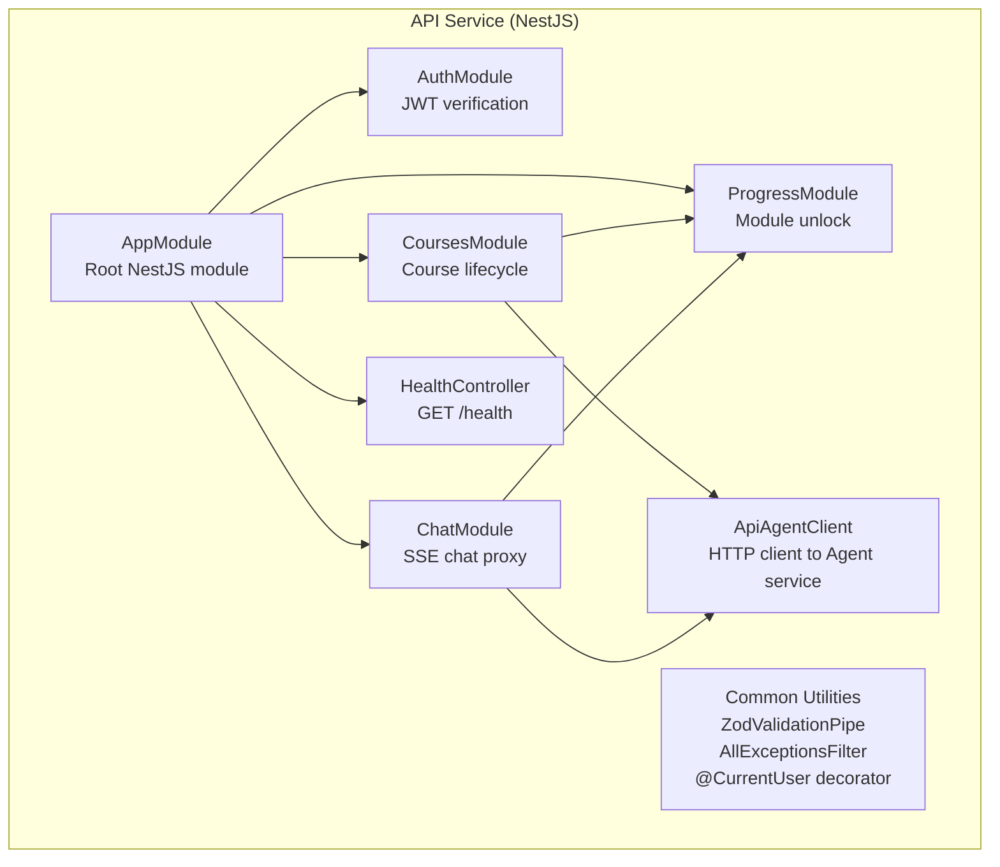
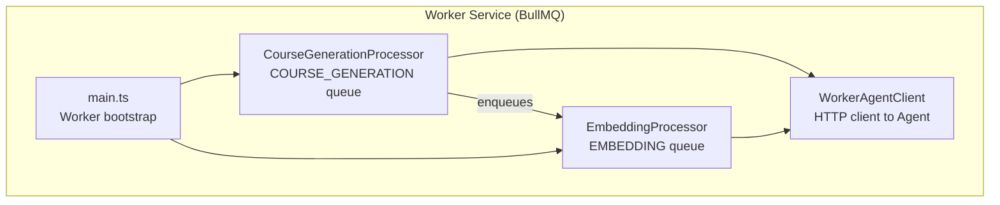
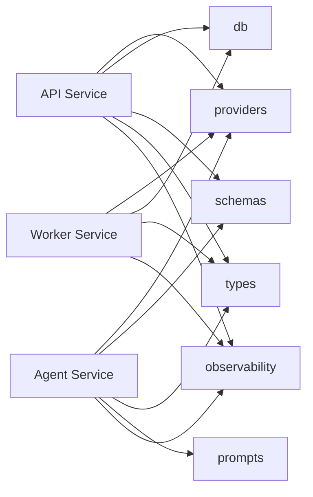

# C4 Level 3 — Components

This diagram zooms into each service container and shows its internal components, their responsibilities, and the relationships between them.

---

## API Service Components



| Component | Files | Responsibility |
|-----------|-------|----------------|
| **AuthModule** | `modules/auth/` | Provides `AuthGuard` (guards all routes). Delegates JWT verification to `IAuthProvider`. Injects `AuthUser` into request via `@CurrentUser()`. |
| **CoursesModule** | `modules/courses/` | `POST /courses` — semantic similarity check then enroll or enqueue. `GET /courses` — user's enrolled courses. `GET /courses/:id` — course with modules. `POST /courses/:id/enroll`. `GET /courses/status/:jobId` — job polling. |
| **ChatModule** | `modules/chat/` | `POST /chat/sessions` — creates `chat_session` row. `POST /chat/sessions/:id/stream` — appends user message, proxies Agent SSE, persists assistant message, triggers completion logic. |
| **ProgressModule** | `modules/progress/` | `GET /progress/:courseId` — module progress list. `POST /progress/:moduleId/start`. Called internally by ChatModule to complete modules and unlock the next. |
| **ApiAgentClient** | `services/agent.client.ts` | Thin HTTP wrapper for the Agent service. Methods: `generateEmbedding(text)`, `streamChat(body)`. Reads `AGENT_SERVICE_URL` env var. |
| **Common Utilities** | `common/` | `ZodValidationPipe` — validates request bodies against Zod schemas. `AllExceptionsFilter` — normalises all errors to structured JSON. `@CurrentUser()` — parameter decorator extracting `req.user`. |

---

## Agent Service Components

```mermaid
graph TD
    subgraph "Agent Service (Fastify)"
        MAIN[main.ts<br/>Fastify bootstrap]
        GCR[/generate-course<br/>POST route]
        MCR[/module-chat/stream<br/>POST SSE route]
        EMB[/embeddings/text<br/>POST route]

        subgraph "LangGraph Graphs"
            CGG[CourseGenerationGraph<br/>generateBlueprint node]
            MCG[ModuleChatGraph<br/>teacher + evaluator nodes]
        end
    end

    MAIN --> GCR
    MAIN --> MCR
    MAIN --> EMB
    GCR --> CGG
    MCR --> MCG
```

| Component | Files | Responsibility |
|-----------|-------|----------------|
| **CourseGenerationGraph** | `graphs/course-generation/` | LangGraph `StateGraph`. Single node: `generateBlueprint`. Calls LLM with curriculum designer system prompt, extracts JSON, validates against `CourseBlueprintSchema`. Retries up to 3 times on parse failure. |
| **ModuleChatGraph** | `graphs/module-chat/` | LangGraph `StateGraph`. Two nodes: `teacher` and `evaluator`. Teacher node invokes LLM with module system prompt; detects `[MODULE_COMPLETE:score=N]` signal. Evaluator node scores the conversation. Checkpointed by `thread_id` (= session UUID). |
| **GenerateCourseRoute** | `routes/generate-course.ts` | `POST /generate-course` — validates body, runs `CourseGenerationGraph`, returns `{ blueprint }`. |
| **ModuleChatRoute** | `routes/module-chat.ts` | `POST /module-chat/stream` — sets SSE headers, streams graph output token-by-token, reads final state to emit `module_complete` event. |
| **EmbeddingsRoute** | `routes/embeddings.ts` | `POST /embeddings/text` — calls `IEmbeddingProvider.embed(text)`, returns `{ embedding: number[] }`. |

---

## Worker Service Components



| Component | Files | Responsibility |
|-----------|-------|----------------|
| **CourseGenerationProcessor** | `processors/course-generation.processor.ts` | Dequeues `GENERATE_COURSE` jobs. Updates course status `pending → generating`. Calls Agent `/generate-course`. Saves blueprint + modules in a DB transaction. Updates status `generating → ready`. Enqueues `GENERATE_EMBEDDING` job. Concurrency: 3. |
| **EmbeddingProcessor** | `processors/embedding.processor.ts` | Dequeues `GENERATE_EMBEDDING` jobs. Calls Agent `/embeddings/text`. Stores `topic_embedding` vector via raw SQL (`::vector` cast). Concurrency: 5. |
| **WorkerAgentClient** | `services/agent.client.ts` | Typed HTTP wrapper. `generateCourse(data)`, `generateEmbedding(topic)`. Reads `AGENT_SERVICE_URL`. |

---

## Shared Package Components (cross-cutting)



| Package | Key Export | Used By |
|---------|-----------|---------|
| `@autodidact/providers` | `ILLMProvider`, `IEmbeddingProvider`, `IQueueProvider`, `IAuthProvider`, `ICheckpointerProvider` + factory functions | All 3 services |
| `@autodidact/db` | `getDb()`, Drizzle schema tables, `eq`, `sql` etc. | API, Worker |
| `@autodidact/types` | `CourseBlueprint`, `ModuleBlueprint`, `ChatMessage`, `AuthUser`, job data types | All 3 services |
| `@autodidact/schemas` | Zod schemas for request validation | API, Agent |
| `@autodidact/prompts` | System prompts + builders for LLM interactions | Agent only |
| `@autodidact/observability` | `createLogger(service)`, `initTracer(service)` | All 3 services |

---

_Previous: [C4 Level 2 — Containers](c4-containers.md)_

_For code-level detail on individual folders, see the README.md inside each subfolder (e.g., `services/agent/src/graphs/module-chat/README.md`)._
