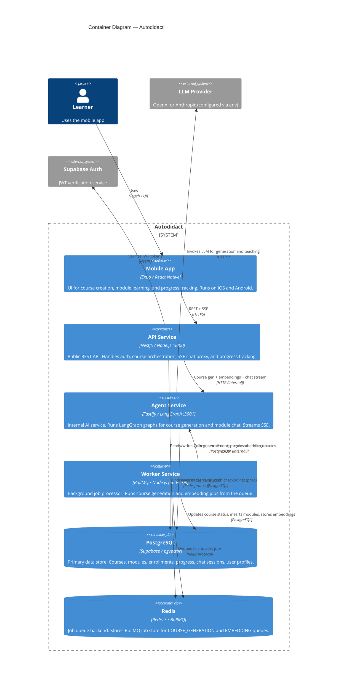

# C4 Level 2 — Containers

This diagram zooms into the Autodidact system and shows each deployable unit (container), its technology, and how containers communicate.



## Container Descriptions

### Mobile App
| | |
|---|---|
| **Technology** | Expo + React Native + TypeScript |
| **Routing** | Expo Router (file-based) |
| **State** | TanStack Query (server state), Zustand (auth session + streaming chat) |
| **Auth token** | Stored in Expo SecureStore via Zustand persist |
| **SSE** | `@microsoft/fetch-event-source` for streaming chat |
| **Network** | Talks only to API Service (never directly to Agent or Worker) |

### API Service
| | |
|---|---|
| **Technology** | NestJS + TypeScript |
| **Port** | 3000 (public, behind Cloud Run ingress) |
| **Auth** | `AuthGuard` verifies Supabase JWT on every protected route |
| **DI** | 4 feature modules: Auth, Courses, Chat, Progress. Queue provider injected by token. |
| **SSE proxy** | Chat stream: proxies Agent SSE via native `fetch` → RxJS `Subject` → NestJS `@Sse` |
| **Queue** | Enqueues `COURSE_GENERATION` jobs via `IQueueProvider` |

### Agent Service
| | |
|---|---|
| **Technology** | Fastify + LangGraph TypeScript |
| **Port** | 3001 (**internal only** — not publicly accessible) |
| **Graphs** | `CourseGenerationGraph` and `ModuleChatGraph` (see C4 Level 3) |
| **Checkpointer** | `MemorySaver` in dev, `PostgresSaver` in prod (controlled by `CHECKPOINTER` env) |
| **Streaming** | Raw SSE via `reply.raw.write()` with `streamMode: 'messages'` |

### Worker Service
| | |
|---|---|
| **Technology** | Node.js + BullMQ (no HTTP server) |
| **Queues** | `COURSE_GENERATION` (concurrency 3), `EMBEDDING` (concurrency 5) |
| **Job chaining** | After course generation completes, enqueues `EMBEDDING` job automatically |
| **Retries** | 3 attempts, exponential backoff (5 s base delay) |
| **Deployment** | Cloud Run with min 1 instance (always-on daemon) |

### PostgreSQL (Supabase)
| | |
|---|---|
| **Extension** | `pgvector` for 1536-dimensional topic embeddings |
| **RLS** | Row Level Security applied in migration 0003 |
| **Access** | API and Worker via `DATABASE_URL` (Drizzle ORM). Agent in prod for checkpointer. |
| **Schema** | 6 tables: `users`, `courses`, `modules`, `enrollments`, `module_progress`, `chat_sessions` |

### Redis
| | |
|---|---|
| **Version** | Redis 7 |
| **Deployment** | GCP Memorystore (prod), Docker (local dev) |
| **Usage** | BullMQ queue backend only (no session storage or caching) |
| **Queues** | `course-generation`, `embedding` |

## Communication Map

| From | To | Protocol | Description |
|------|----|----------|-------------|
| Mobile | API | HTTPS REST | Course creation, listing, enrollment, progress |
| Mobile | API | HTTPS SSE | Chat message streaming |
| API | Agent | HTTP POST | Embedding generation, SSE chat proxying |
| API | Agent | HTTP POST | (via Worker) Course blueprint generation |
| API | Redis | Redis | Enqueue `COURSE_GENERATION` job |
| Worker | Redis | Redis | Dequeue and ack jobs |
| Worker | Agent | HTTP POST | `/generate-course`, `/embeddings/text` |
| Worker | PostgreSQL | SQL | Update course status, insert modules, store embeddings |
| Agent | LLM Provider | HTTPS | Course generation, teaching, evaluation |
| Agent | PostgreSQL | SQL | LangGraph checkpoint reads/writes (prod only) |

## Network Boundaries

```
Internet
  └── Cloud Run (public ingress)
        └── API Service (:3000)
              ├── → Agent Service (:3001)  [Cloud Run internal]
              ├── → Redis                  [VPC private]
              └── → Supabase PostgreSQL    [external managed]
Worker Service  [Cloud Run internal, no inbound]
              ├── → Agent Service
              ├── → Redis
              └── → Supabase PostgreSQL
```

---

_Previous: [C4 Level 1 — Context](c4-context.md) | Next: [C4 Level 3 — Components](c4-components.md)_
