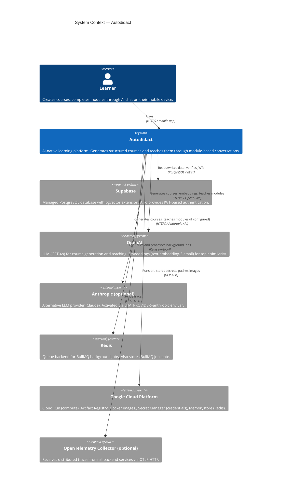

# C4 Level 1 — System Context

This diagram shows Autodidact as a single system box and maps out every external actor and dependency it communicates with.

## Actors

| Actor | Type | Description |
|-------|------|-------------|
| Learner | Person | The end user. Creates courses by entering a topic, then works through sequential module chats on a mobile device. |

## External Systems

| System | Role |
|--------|------|
| **Supabase** | PostgreSQL database (primary data store), JWT auth (user sign-up/sign-in), pgvector extension (course similarity search), Row Level Security policies. |
| **OpenAI** | Default LLM for course generation and AI teaching. Default embedding model for topic similarity. |
| **Anthropic** | Optional alternative LLM. Activated with a single env var (`LLM_PROVIDER=anthropic`), no code changes needed. |
| **Redis** | Backing store for BullMQ background job queues. Holds job state, retries, and delays. In production: GCP Memorystore. |
| **Google Cloud Platform** | Compute (Cloud Run), container registry (Artifact Registry), secret storage (Secret Manager), managed Redis (Memorystore). |
| **OpenTelemetry Collector** | Optional trace aggregation. All services are instrumented but the exporter is a no-op unless `OTEL_EXPORTER_OTLP_ENDPOINT` is set. |

## What crosses the system boundary

- **Inbound**: Mobile app sends HTTPS requests and consumes Server-Sent Events.
- **Outbound (data)**: Course blueprints, embeddings, and conversation history are persisted in Supabase PostgreSQL.
- **Outbound (AI)**: Every course generation and every chat message turn calls the configured LLM provider.
- **Outbound (async)**: Course generation jobs are enqueued to Redis; workers pull and process them independently.

## What stays inside

The API, Agent, and Worker services are all internal. The mobile app only talks to the API service directly. The Agent service is never exposed publicly.

---

_Next: [C4 Level 2 — Containers](c4-containers.md)_
