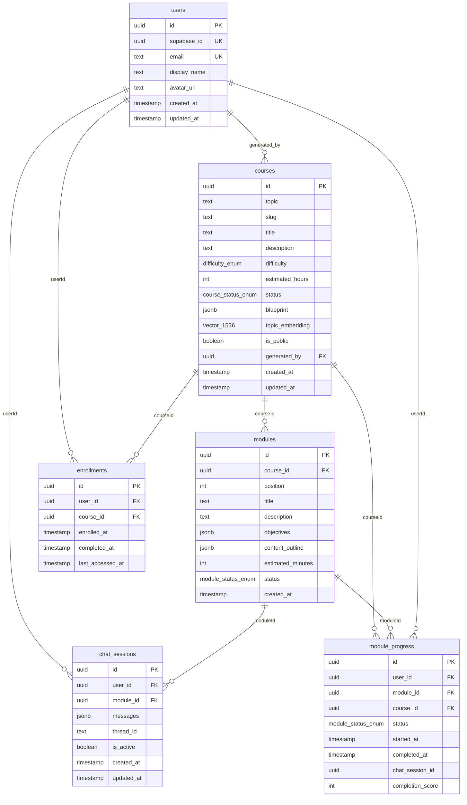

# Data Model

All data lives in a single Supabase PostgreSQL database managed via Drizzle ORM. Schema definitions are in `packages/db/src/schema/`.

---

## Entity-Relationship Diagram



---

## Table Reference

### `users`
Mirrors the Supabase Auth user. Created on first sign-in.

| Column | Type | Notes |
|--------|------|-------|
| `id` | UUID PK | Internal app ID |
| `supabase_id` | UUID UNIQUE | Supabase Auth UID |
| `email` | TEXT UNIQUE | |
| `display_name` | TEXT | Nullable |
| `avatar_url` | TEXT | Nullable |

### `courses`
A course blueprint + metadata. Status transitions: `pending → generating → ready` (or `failed`).

| Column | Type | Notes |
|--------|------|-------|
| `id` | UUID PK | |
| `topic` | TEXT | Original user request |
| `slug` | TEXT | URL-safe, auto-generated from topic |
| `title` | TEXT | LLM-generated title |
| `description` | TEXT | LLM-generated description |
| `difficulty` | ENUM | `beginner` / `intermediate` / `advanced` |
| `estimated_hours` | INT | Nullable until generation completes |
| `status` | ENUM | `pending` / `generating` / `ready` / `failed` |
| `blueprint` | JSONB | Full `CourseBlueprint` object (redundant with modules table, kept for convenience) |
| `topic_embedding` | VECTOR(1536) | OpenAI `text-embedding-3-small` embedding of `topic`. Set async after generation. |
| `is_public` | BOOLEAN | Default `true`. Controls course reuse eligibility. |
| `generated_by` | UUID FK → users | Nullable (future: anonymous generation) |

### `modules`
Individual learning units within a course. Inserted in a transaction when the course blueprint is saved.

| Column | Type | Notes |
|--------|------|-------|
| `id` | UUID PK | |
| `course_id` | UUID FK → courses | CASCADE DELETE |
| `position` | INT | 0-indexed. Order is enforced by application logic. |
| `title` | TEXT | |
| `description` | TEXT | |
| `objectives` | JSONB (`string[]`) | Learning objectives used in the teaching prompt |
| `content_outline` | JSONB (`ContentSection[]`) | `{ title: string; points: string[] }[]` |
| `estimated_minutes` | INT | |
| `status` | ENUM | Default `locked`. Per-course status (not per-user). |

> Note: The `status` column on `modules` represents the default state for the module blueprint. Per-user status lives in `module_progress`.

### `enrollments`
Junction table linking a user to a course. Unique per (user, course) pair.

| Column | Type | Notes |
|--------|------|-------|
| `user_id` | UUID FK → users | |
| `course_id` | UUID FK → courses | |
| `enrolled_at` | TIMESTAMP | |
| `completed_at` | TIMESTAMP | Set when all module_progress rows for this course are `completed` |
| `last_accessed_at` | TIMESTAMP | Updated on re-enrollment / access |

### `module_progress`
Per-user progress through a specific module. Created for every module when a user enrolls. Unique per (user, module) pair.

| Column | Type | Notes |
|--------|------|-------|
| `user_id` | UUID FK → users | |
| `module_id` | UUID FK → modules | |
| `course_id` | UUID FK → courses | Denormalised for faster queries |
| `status` | ENUM | `locked` / `available` / `in_progress` / `completed` |
| `started_at` | TIMESTAMP | Set when status → `in_progress` |
| `completed_at` | TIMESTAMP | Set when status → `completed` |
| `chat_session_id` | UUID | **Reserved — not currently populated.** Will link to `chat_sessions.id` in Phase 2. |
| `completion_score` | INT | 0–100. Set on completion. |

### `chat_sessions`
A conversation between a user and the AI for one module. A new session is created each time the user enters the module chat screen.

| Column | Type | Notes |
|--------|------|-------|
| `user_id` | UUID FK → users | |
| `module_id` | UUID FK → modules | |
| `messages` | JSONB (`ChatMessage[]`) | Full conversation history. Appended on every turn. |
| `thread_id` | TEXT | UUID used as LangGraph `thread_id` for checkpointer keying. **Not the same as `id`.** |
| `is_active` | BOOLEAN | Default `true` |

---

## Enum Types

| Type | Values |
|------|--------|
| `course_status_enum` | `pending`, `generating`, `ready`, `failed` |
| `module_status_enum` | `locked`, `available`, `in_progress`, `completed` |
| `difficulty_enum` | `beginner`, `intermediate`, `advanced` |

---

## pgvector Usage

The `topic_embedding` column on `courses` stores a 1536-dimensional float vector produced by OpenAI's `text-embedding-3-small` model. It enables efficient cosine similarity search for course reuse.

**Similarity query** (in `CoursesService.createOrReuse`):
```sql
SELECT id, title,
       1 - (topic_embedding <=> '[0.12, -0.03, ...]'::vector) AS similarity
FROM courses
WHERE status = 'ready'
  AND is_public = TRUE
  AND topic_embedding IS NOT NULL
  AND 1 - (topic_embedding <=> '[...]'::vector) > 0.92
ORDER BY similarity DESC
LIMIT 1;
```

The `<=>` operator is pgvector's cosine distance operator. `1 - distance = similarity`. Threshold **0.92** means "nearly identical topic".

---

## Module Unlock SQL

When a module is completed, the next module in sequence is unlocked for that user:

```sql
UPDATE module_progress mp
SET status = 'available'
FROM modules m
WHERE mp.module_id = m.id
  AND mp.user_id = $userId
  AND mp.course_id = $courseId
  AND mp.status = 'locked'
  AND m.position = (
    SELECT position + 1
    FROM modules
    WHERE id = $completedModuleId
  );
```

This single query atomically finds and unlocks the next module without needing to know its ID.

---

## Row Level Security

RLS policies are applied in migration `0003_rls.sql`. They ensure users can only read their own enrollments, progress, and chat sessions. The API service bypasses RLS by using the Supabase service role key; client applications would be subject to RLS if they accessed the database directly.

---

## Migrations

Managed by Drizzle Kit. Run with:
```bash
pnpm --filter @autodidact/db db:migrate
```

| File | Description |
|------|-------------|
| `0001_initial.sql` | All tables, enums, `CREATE EXTENSION IF NOT EXISTS vector` |
| `0002_indexes.sql` | Performance indexes (FKs, status columns, embedding HNSW index) |
| `0003_rls.sql` | Row Level Security policies |
