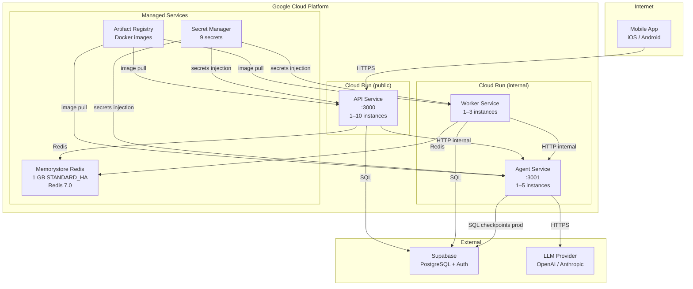

# Infrastructure

Autodidact runs entirely on Google Cloud Platform. All compute is Cloud Run (serverless containers). Infrastructure is defined as code using Terraform.

---

## Topology



---

## Cloud Run Service Configuration

| Service | Public | CPU | Memory | Min | Max | Notes |
|---------|--------|-----|--------|-----|-----|-------|
| `api` | Yes | 1 | 512 Mi | 1 | 10 | Public ingress; scales with traffic |
| `agent` | No | 2 | 2 Gi | 1 | 5 | Higher memory for LangGraph + LLM responses |
| `worker` | No | 1 | 512 Mi | 1 | 3 | Always-on daemon (min 1); no HTTP inbound |

Cloud Run services use a dedicated service account (`autodidact-run`) with least-privilege IAM bindings.

---

## Secret Management

Secrets are stored in **GCP Secret Manager** and injected as environment variables at container startup. No secrets are baked into images or committed to the repository.

| Secret Name | Used By | Description |
|-------------|---------|-------------|
| `DATABASE_URL` | api, worker, agent (prod) | PostgreSQL connection string |
| `REDIS_URL` | api, worker | Redis connection string |
| `SUPABASE_URL` | api, agent | Supabase project URL |
| `SUPABASE_JWT_SECRET` | api | JWT verification key |
| `SUPABASE_SECRET_KEY` | api, worker | Supabase admin access |
| `OPENAI_API_KEY` | agent | OpenAI API key |
| `ANTHROPIC_API_KEY` | agent | Anthropic API key (optional) |
| `OTEL_EXPORTER_OTLP_ENDPOINT` | api, agent, worker | Trace exporter (optional) |
| `AGENT_SERVICE_URL` | api, worker | Internal URL of Agent service |

---

## Terraform Structure

```
infra/
├── backend.tf                    # GCS state backend (autodidact-terraform-state)
├── providers.tf                  # google provider ~> 5.0
├── environments/
│   └── prod/
│       ├── main.tf               # Wires all modules together, configures secrets
│       └── variables.tf          # project_id, region, service_account_name
└── modules/
    ├── artifact-registry/        # Creates Docker registry
    ├── cloud-run-service/        # Reusable Cloud Run module (scaling, secrets, IAM)
    └── redis/                    # Memorystore Redis instance
```

**State**: Remote in GCS bucket `autodidact-terraform-state`. Terraform >= 1.9.0.

To deploy:
```bash
cd infra/environments/prod
terraform init
terraform plan -var="project_id=YOUR_PROJECT"
terraform apply -var="project_id=YOUR_PROJECT"
```

---

## CI/CD Pipeline

GitHub Actions handles the full deployment pipeline on push to `main`.

```
push to main
  ├── lint + typecheck (all packages)
  ├── test (all packages)
  ├── Docker build + push → Artifact Registry
  │     (api, agent, worker — parallel)
  ├── pnpm --filter @autodidact/db db:migrate
  │     (runs against production DATABASE_URL)
  └── Cloud Run deploy
        (api, agent, worker — parallel)
```

**Authentication**: Workload Identity Federation — GitHub Actions authenticates to GCP without service account key files. The federation is configured in Terraform and bound to the `autodidact-run` service account.

---

## Local Development

| Concern | Local | Production |
|---------|-------|------------|
| PostgreSQL | Docker (`pgvector/pgvector:pg16`) | Supabase managed |
| Redis | Docker (`redis:7-alpine`) | GCP Memorystore |
| LLM | OpenAI API (same) | OpenAI or Anthropic |
| Auth | Supabase (same project) | Supabase (same project) |
| Checkpointer | `MemorySaver` (in-process) | `PostgresSaver` (DB) |
| Secrets | `.env` file | GCP Secret Manager |
| Services | `pnpm dev` (ts-node watch) | Docker containers on Cloud Run |

Start local infrastructure:
```bash
docker compose up -d      # starts Postgres + Redis
pnpm --filter @autodidact/db db:migrate
pnpm dev                  # starts api + agent + worker in watch mode
```
